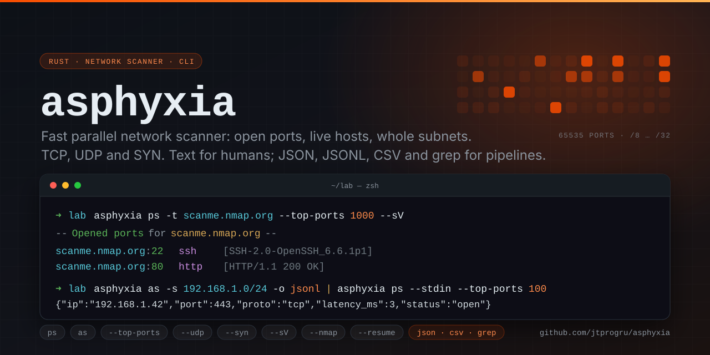

# Asphyxia

[](https://github.com/jtprogru/asphyxia/actions/workflows/ci.yml)
[](https://github.com/jtprogru/asphyxia/actions/workflows/rust-release.yml)
[](https://crates.io/crates/asphyxia)
[](https://docs.rs/asphyxia)
[](https://crates.io/crates/asphyxia)
[](https://www.rust-lang.org)
[](LICENSE)

<p align="center">
  
</p>

A fast and efficient network scanner written in Rust.

## Description

Asphyxia is a command-line network scanner that helps you discover open ports on a host and find reachable hosts on a network. It runs scans in parallel for speed and shows live progress while it works.

## Features

- **Port scanning** — scan a range of ports, a specific comma-separated list, the entire port range (`--all-ports`), the N most common ports (`--top-ports`), or a named port set (`--ports web`) on a target host.
- **Address scanning** — check a single IP, scan an IP range, or scan an entire subnet (CIDR).
- **Chainable scans** — pipe the hosts an address scan discovers straight into a port scan with `--stdin`, turning host discovery and port scanning into a single pipeline.
- **IPv4 and IPv6** — every scan mode accepts both address families.
- **Configurable timeout** — tune the per-connection timeout with `--timeout`.
- **Parallel execution** — scans run concurrently via [rayon](https://crates.io/crates/rayon), with tunable concurrency (`--concurrency`) for large subnet scans.
- **Live progress bars** — long-running scans show real-time progress.
- **Colorized output** — readable, colored terminal output.
- **Machine-readable output** — emit results as JSON, JSON Lines, CSV, or greppable text with `--output`, and write them straight to a file with `--output-file`, for piping into other tools.

- **Target sources** — scan a single host, pipe targets in with `--stdin`, or read them from a file with `-i/--target-file`; hosts, IPs, and CIDRs are all accepted, and CIDRs in a file are expanded.
- **Configuration file** — set defaults (timeout, concurrency, retries, output format, bind interface) in `~/.asphyxia.toml`; command-line flags override it.
- **Resumable scans** — checkpoint a long port scan with `--resume <file>` and pick it up where it stopped after a Ctrl-C, crash, or dropped link.
- **SYN/stealth scan** — half-open SYN scanning with `--syn` (IPv4, needs privileges): SYNs are sent over a raw socket and replies captured with libpcap/BPF, so it works the same on macOS and Linux, with automatic fallback to the connect scan.
- **Interface binding** — pin every probe to a specific network interface with `-e/--interface` (like `ssh -B` or `nmap -e`), so a host reachable only through a VPN, tunnel, or a more specific route is scanned over the right link instead of the default route.

> Note: IPv6 subnet and range scans are capped at 65 536 addresses (e.g. a `/112`), since larger IPv6 spaces are impractical to walk exhaustively.

## Installation

### Homebrew (macOS & Linux)

```bash
brew tap jtprogru/tap
brew install jtprogru/tap/asphyxia
```

The formula is published automatically to the [jtprogru/homebrew-tap](https://github.com/jtprogru/homebrew-tap) tap on every release and supports macOS (Apple Silicon) and Linux (x86_64 & arm64).

### Cargo

Install the latest published release from [crates.io](https://crates.io/crates/asphyxia):

```bash
cargo install asphyxia
```

Or install the current `main` branch straight from the repository:

```bash
cargo install --git https://github.com/jtprogru/asphyxia
```

### Prebuilt binaries

Download the archive for your platform from the [latest release](https://github.com/jtprogru/asphyxia/releases/latest), unzip it, and place the `asphyxia` binary somewhere on your `PATH`. Builds are provided for:

- Linux: `x86_64`, `aarch64`
- macOS: `aarch64` (Apple Silicon)

Each archive is shipped with a detached GPG signature (`.asc`). After importing the signing key you can verify an archive with:

```bash
gpg --verify asphyxia-<target>.zip.asc asphyxia-<target>.zip
```

### Building from source

Requires Rust 1.88 or newer (the project uses the 2024 edition) and libpcap development headers for the SYN-scan reply capture. libpcap ships with macOS; on Linux install it first (`sudo apt-get install libpcap-dev` on Debian/Ubuntu, `sudo apk add libpcap-dev` on Alpine, `sudo pacman -S libpcap` on Arch).

```bash
git clone https://github.com/jtprogru/asphyxia.git
cd asphyxia
cargo build --release
```

The compiled binary will be available at `target/release/asphyxia`.

## Usage

Asphyxia exposes two subcommands: `ps` (port scan) and `as` (address scan).

```bash
asphyxia --help        # general help
asphyxia ps --help     # port scan options
asphyxia as --help     # address scan options
```

### Port scanning (`ps`)

```bash
# Scan a range of ports (start end)
asphyxia ps -t example.com -r 80 443

# Scan specific ports (comma-separated)
asphyxia ps -t example.com -s 22,80,443,8080

# Scan every port (1-65535)
asphyxia ps -t example.com --all-ports

# Scan the N most common TCP ports (frequency-ordered, no manual list)
asphyxia ps -t example.com --top-ports 100
asphyxia ps -t example.com --top-ports 1000

# Scan UDP ports instead of TCP (DNS, NTP, SNMP, …)
asphyxia ps -t example.com -s 53,123,161 --udp

# SYN/stealth scan via raw sockets (needs root/CAP_NET_RAW)
sudo asphyxia ps -t example.com --top-ports 1000 --syn

# Grab banners and identify services on open ports
asphyxia ps -t example.com -s 22,80,443 --sV

# Scan a named port set (web, mail, db, remote, windows)
asphyxia ps -t example.com --ports web

# Drop specific ports from the set, and spare known CDN/WAF targets (80/443 only)
asphyxia ps -t example.com --top-ports 1000 --exclude-ports 9100,631
asphyxia ps --stdin --top-ports 1000 --exclude-cdn < hosts.txt

# Find open ports fast, then hand them to nmap for a deep dive
asphyxia ps -t scanme.nmap.org --top-ports 100 --nmap
asphyxia ps -t scanme.nmap.org --top-ports 100 --nmap --nmap-args "-A -T4"

# Scan an IPv6 host with a shorter timeout
asphyxia ps -t 2001:db8::1 -s 22,80,443 --timeout 500

# Read targets from stdin instead of -t (one host per line, or JSON/JSONL from `as`)
asphyxia ps --stdin -s 22,80,443 < hosts.txt

# Read targets from a file (hosts, IPs, or CIDRs; CIDRs are expanded)
asphyxia ps -i targets.txt --top-ports 100
```

Exactly one target source is required — `-t/--host`, `--stdin`, or `-i/--target-file` — and they are mutually exclusive. Likewise `-r`, `-s`, `--all-ports`, `--top-ports`, and `--ports` are mutually exclusive.

| Flag | Description |
|------|-------------|
| `-t, --host <HOST>` | Target host (hostname, IPv4, or IPv6) |
| `--stdin` | Read targets from stdin instead of `-t`: one host per line, or the JSON/JSONL emitted by `asphyxia as -o` (the `ip` field is used) |
| `-i, --target-file <PATH>` (`--iL`) | Read targets from a file: hosts, IPs, CIDRs (expanded), or `as` JSON/JSONL, one per line |
| `-r, --range <START> <END>` | Scan an inclusive range of ports |
| `-s, --specific <PORTS>` | Scan specific comma-separated ports |
| `-a, --all-ports` | Scan the entire port range (1-65535) |
| `-u, --udp` | Scan UDP ports instead of TCP (results are `open` or `open\|filtered`) |
| `--syn` | SYN/stealth scan via raw sockets (IPv4; needs root/`CAP_NET_RAW`, else falls back to connect) |
| `--sV` (`--banner`) | Grab banners and identify the service on each open TCP port |
| `--resume <PATH>` | Checkpoint progress to a file and resume from it if it already exists |
| `--top-ports <N>` | Scan the `N` most common TCP ports (frequency-ordered, up to 1000) |
| `--ports <NAME>` | Scan a named port set: `web`, `mail`, `db`, `remote`, `windows` |
| `--exclude-ports <PORTS>` | Remove these comma-separated ports from the scan set |
| `--exclude-cdn` | For known CDN/WAF targets, scan only 80 and 443 instead of the full set |
| `--nmap` | After the scan, run nmap on each host's open ports for a deep dive |
| `--nmap-args <ARGS>` | Custom nmap arguments (replace the default `-sV -sC`); implies `--nmap` |
| `--timeout <MS>` | Per-connection timeout in milliseconds (default: 2000) |
| `-e, --interface <NAME>` (`--iface`) | Bind every probe to this network interface (e.g. `en0`), like `ssh -B` / `nmap -e` |
| `-c, --concurrency <N>` | Maximum concurrent connection attempts (default: 256) |
| `--retries <N>` | Extra retries per probe on no answer/timeout (default: 0); refused ports are never retried |
| `--rate <PPS>` | Cap connection attempts per second across the whole scan (0 or unset: no cap) |
| `-T, --timing <0-5>` | Timing profile from `0` (paranoid) to `5` (insane), presetting timeout/concurrency/retries/rate |
| `-o, --output <FORMAT>` | Output format: `text` (default), `json`, `jsonl`, `csv`, or `grep` |
| `--output-file <PATH>` (`--oF`) | Write machine-readable output to a file instead of stdout |

#### UDP scanning (`--udp`)

Pass `-u`/`--udp` to probe UDP ports instead of TCP. UDP has no handshake, so results are inherently less certain than TCP and use two statuses:

- **`open`** — the port sent a reply. For a few well-known ports asphyxia sends a protocol-specific probe (a DNS query on 53, an NTP client request on 123) to coax a reply and turn what would otherwise be a guess into a definite `open`.
- **`open|filtered`** — the port stayed silent within the timeout. The datagram may have been dropped, the service may not answer this particular probe, or a firewall may be filtering it — these are indistinguishable without elevated privileges.

A port that answers with an ICMP port-unreachable is **closed** and is simply not reported (like a closed TCP port). In machine output the `proto` field is `"udp"` and `status` is `"open"` or `"open|filtered"`. Because silent ports wait out the full `--timeout`, UDP scans of many ports are slower than TCP — narrow the port set (e.g. `-s 53,123,161,500` or `--top-ports`) and consider `--retries 1` on a lossy link.

```bash
asphyxia ps -t 192.168.1.1 -s 53,123,161 --udp
asphyxia ps -t 192.168.1.1 -s 53,123,161 --udp -o jsonl
# {"ip":"192.168.1.1","port":53,"proto":"udp","latency_ms":4,"status":"open"}
```

#### Service & version detection (`--sV`)

Add `--sV` (alias `--banner`) to identify what is listening on each open TCP port. For every open port asphyxia grabs a small banner — reading whatever the service announces on connect (SSH, SMTP, FTP), and nudging quiet services with a minimal HTTP request — then matches it against a compact set of built-in signatures (SSH, HTTP, SMTP, FTP, POP3/IMAP, MySQL, Redis, …). When no banner can be matched it falls back to the well-known name for the port.

This is a lightweight identifier, not a full nmap-service-probes database — for exhaustive detection, combine it with `--nmap`. In machine output the `service` and `banner` fields are added to each record (omitted when nothing was found); in text output they are shown next to the port.

```bash
asphyxia ps -t example.com -s 22,80,443 --sV
asphyxia ps -t example.com --top-ports 100 --sV -o jsonl
# {"ip":"93.184.216.34","port":22,"proto":"tcp","latency_ms":7,"status":"open","service":"ssh","banner":"SSH-2.0-OpenSSH_9.6"}
```

#### SYN / stealth scan (`--syn`)

`--syn` performs a half-open SYN scan: it sends a lone TCP SYN and never completes the handshake — a SYN/ACK means open, a RST means closed, silence means filtered. This is faster and quieter than the default connect scan, at the cost of needing elevated privileges. The SYN is forged and sent over a raw socket, and replies are read with libpcap/BPF through a single shared capture — the same approach nmap uses, and the reason it works the same on macOS and Linux.

```bash
sudo asphyxia ps -t scanme.nmap.org --top-ports 1000 --syn
```

Details and limitations:

- **Privileges** — forging raw packets and capturing replies requires root or `CAP_NET_RAW`. Without them, asphyxia prints a notice and automatically falls back to the connect scan, so the command still works unprivileged (just not stealthily).
- **libpcap** — the reply capture uses libpcap. It is present by default on macOS; on Linux install `libpcap` (e.g. `libpcap-dev`/`libpcap0.8` on Debian/Ubuntu, `libpcap` on Alpine/Arch). If the capture can't be opened, asphyxia warns and falls back to the connect scan.
- **IPv4 only** — IPv6 targets always use the connect scan.
- **Correctness fallback** — a port that a SYN probe reports as *filtered* (no reply) is re-checked with a connect probe, so an open port is never missed if a reply is lost. Definitive open/closed SYN results are used directly.
- **High-latency links** — a SYN probe waits up to `--timeout` for its reply. On slow paths (distant hosts, VPNs) a reply can arrive just after the deadline and the probe then falls back to a connect check (still correct, just not stealthy). Raise `--timeout` on such links so SYN replies land in time.
- **Diagnostics** — set `ASPHYXIA_SYN_DEBUG=1` to print capture diagnostics to stderr (the chosen interface and datalink, each captured reply, and each probe's outcome), useful when a scan unexpectedly falls back.
- `--syn` and `--udp` are mutually exclusive.

#### Selecting the outgoing interface (`-e`/`--interface`)

By default the OS routes every probe through whatever the routing table picks — usually the default route. When a host is reachable only through a particular interface (a VPN, a tunnel, a secondary link carrying a more specific route whose source address the default route never uses), the probes have to be pinned to that interface, exactly as `ssh -B en0` or `nmap -e en0` do. Otherwise the kernel sends from the wrong source address and the replies never come back, so an open port looks closed. `-e/--interface` binds every probe socket to the named interface for both `ps` and `as`.

```bash
# Scan through en0 specifically, whatever the default route would pick
asphyxia ps -t fin.example.com --top-ports 1000 --interface en0
asphyxia as -s 10.20.0.0/24 -e en0
```

Details and limitations:

- **Platforms** — macOS/BSD-family and illumos/Solaris use `IP_BOUND_IF`/`IPV6_BOUND_IF` (no privileges needed); Linux/Android use `SO_BINDTODEVICE`, which needs root or `CAP_NET_RAW`. On any other platform the flag is rejected up front rather than silently ignored.
- **Fail fast** — an unknown interface name, or a bind the OS refuses (e.g. `SO_BINDTODEVICE` without privileges), is reported before the scan starts and exits non-zero, so a scan never runs over the wrong route while pretending it was pinned.
- **Coverage** — the interface applies to the connect scan, UDP probes, `--sV` banner grabs, and host discovery. With `--syn` it also steers the source address and the libpcap capture device, so SYN scanning follows the same link.
- **Config** — set `interface = "en0"` in `~/.asphyxia.toml` to make it the default; a command-line `-e` still overrides it.

#### Resuming a long scan (`--resume`)

A big port scan — many hosts × `--all-ports` — can run for a long time, and losing it to Ctrl-C, a dropped connection, or a crash means starting over. `--resume <file>` checkpoints progress to a state file as the scan runs. Re-run the exact same command with the same file and it picks up where it left off, skipping completed `(host, port)` work and keeping the results already found.

```bash
# Start a long scan, checkpointing to scan.state
asphyxia ps -iL targets.txt --all-ports --resume scan.state

# Interrupt it (Ctrl-C) — the state file is flushed on exit — then resume:
asphyxia ps -iL targets.txt --all-ports --resume scan.state
```

The state file is written atomically (temp file + rename) so an interrupt mid-write cannot corrupt it, and it is validated on resume: it only continues when the protocol, targets, and ports match the command, so pointing `--resume` at a file from a different scan safely starts fresh instead of producing bogus results.

### Address scanning (`as`)

```bash
# Scan a subnet in CIDR notation (IPv4 or IPv6)
asphyxia as -s 192.168.1.0/24
asphyxia as -s 2001:db8::/120

# Scan a single IP address (IPv4 or IPv6)
asphyxia as -t 192.168.1.1
asphyxia as -t 2001:db8::1

# Scan a range of IP addresses (start end)
asphyxia as -r 192.168.1.1 192.168.1.20

# Scan a subnet with a custom timeout
asphyxia as -s 192.168.1.0/24 --timeout 300

# Skip discovery and treat every address as up (like nmap -Pn)
asphyxia as -s 192.168.1.0/24 --Pn -o jsonl | asphyxia ps --stdin --top-ports 100

# Exclude hosts/CIDRs from a subnet scan (inline and/or from a file)
asphyxia as -s 192.168.1.0/24 --exclude 192.168.1.0/28 --exclude 192.168.1.100
asphyxia as -s 10.0.0.0/22 --exclude-file skip.txt
```

| Flag | Description |
|------|-------------|
| `-s, --subnet <SUBNET>` | Scan a subnet, e.g. `192.168.1.0/24` or `2001:db8::/120` |
| `-t, --target <IP>` | Scan a single IPv4 or IPv6 address |
| `-r, --range <START> <END>` | Scan an inclusive range of IPs (start and end must share the same family) |
| `--Pn` (`--skip-discovery`) | Skip host discovery and treat every target as up (like nmap `-Pn`) |
| `--exclude <SPEC>` | Exclude hosts/CIDRs from the scan (repeatable; each value may be comma-separated) |
| `--exclude-file <PATH>` | Exclude hosts/CIDRs listed in a file (one per line; `#` comments allowed) |
| `--timeout <MS>` | Per-connection timeout in milliseconds (default: 2000) |
| `-e, --interface <NAME>` (`--iface`) | Bind every probe to this network interface (e.g. `en0`), like `ssh -B` / `nmap -e` |
| `-c, --concurrency <N>` | Maximum concurrent connection attempts (default: 256) |
| `--retries <N>` | Extra retries per probe on no answer/timeout (default: 0); refused ports are never retried |
| `--rate <PPS>` | Cap connection attempts per second across the whole scan (0 or unset: no cap) |
| `-T, --timing <0-5>` | Timing profile from `0` (paranoid) to `5` (insane), presetting timeout/concurrency/retries/rate |
| `-o, --output <FORMAT>` | Output format: `text` (default), `json`, `jsonl`, `csv`, or `grep` |
| `--output-file <PATH>` (`--oF`) | Write machine-readable output to a file instead of stdout |

> `--exclude-cdn` uses a small, static list of well-known CDN/WAF ranges (Cloudflare, Fastly, some Akamai) baked into the binary. It is a convenience, not an authoritative registry, and can drift as providers change allocations.

> Host availability is inferred from TCP probes across a small spread of common ports (80, 443, 22, 3389), tried in order until one answers: a host counts as up when any probed port either accepts the connection or actively refuses it (a closed port still proves the host answered). Probing more than one port finds live hosts that firewall port 80 but answer elsewhere. Only when every probed port times out or is unreachable is the host reported as down — so a host that silently drops packets on all of them may still appear offline. This is an unprivileged, best-effort check, not an ICMP ping; use `--Pn` to skip discovery entirely and treat every target as up.

### Machine-readable output (`--output`)

By default Asphyxia prints a colorized, human-friendly report. Pass `--output` (alias `-o`) with one of `json`, `jsonl`, `csv`, or `grep` to emit structured results instead — for example to feed a network map, a spreadsheet, a ticket, or a downstream tool. Each result is a self-contained record with the fields `ip`, `port` (omitted/blank for address scans), `proto`, `latency_ms`, and `status`.

```bash
# One JSON object per open port, on its own line (JSON Lines)
asphyxia ps -t example.com -s 22,80,443 -o jsonl
# {"ip":"93.184.216.34","port":80,"proto":"tcp","latency_ms":12,"status":"open"}

# A single JSON array of available hosts
asphyxia as -s 192.168.1.0/24 -o json

# CSV with a header row (ip,port,proto,status,latency_ms)
asphyxia ps -t example.com --top-ports 100 -o csv

# Greppable, tab-separated columns for grep/awk/cut
asphyxia ps -t example.com -s 22,80,443 -o grep
```

Records are written to stdout; the progress bar and any errors go to stderr, so a consumer reading stdout sees only the data stream. An empty result is `[]` for `json`, a lone header for `csv`, and no output for `jsonl`/`grep`. Pipe straight into `jq`:

```bash
asphyxia ps -t example.com -r 1 1024 -o jsonl 2>/dev/null | jq -c 'select(.port == 443)'
```

Use `--output-file <PATH>` (alias `--oF`) to write the machine-readable output to a file instead of stdout — handy for saving a scan while still watching the progress bar on the terminal:

```bash
asphyxia ps -t example.com --top-ports 1000 -o csv --output-file scan.csv
```

### Chaining discovery into port scanning (`--stdin`)

`asphyxia ps --stdin` reads its targets from standard input, so the hosts an address scan finds can flow directly into a port scan. The input format is auto-detected line by line: a line that is a JSON object or array has its `ip` field(s) taken as targets (so the `-o json`/`-o jsonl` output of `as` works as-is), and any other non-empty line is treated as a bare host or IP (so a plain `hosts.txt` works too). Blank lines are skipped and duplicate targets are scanned once.

```bash
# Discover live hosts on a subnet, then scan common ports on each of them
asphyxia as -s 192.168.1.0/24 -o jsonl 2>/dev/null \
  | asphyxia ps --stdin -s 22,80,443 -o jsonl

# Same, but scan every port on each discovered host
asphyxia as -s 192.168.1.0/24 -o jsonl 2>/dev/null \
  | asphyxia ps --stdin --all-ports -o jsonl

# Feed a hand-written host list
asphyxia ps --stdin -s 22,80,443 < hosts.txt
```

### Nmap handoff (`--nmap`)

Asphyxia finds open ports quickly; nmap interrogates them thoroughly. `--nmap` bridges the two: after the scan, it groups the open ports by host and runs `nmap` on each, so the classic "scan fast, then deep-dive" workflow is one command.

```bash
# Fast port sweep, then nmap service/version + default scripts on what's open
asphyxia ps -t scanme.nmap.org --top-ports 100 --nmap

# Pass your own nmap flags (these replace the default -sV -sC); ports/target stay owned by asphyxia
asphyxia ps -t scanme.nmap.org --top-ports 100 --nmap --nmap-args "-A -T4"
```

By default asphyxia runs `nmap -sV -sC -p <open-ports> <host>`. With `--nmap-args` your flags replace `-sV -sC`, while asphyxia still supplies `-p <open-ports>` and the target. If nmap is not on your `PATH`, asphyxia prints an install hint instead of a deep dive. Nmap's output streams straight to the terminal, so combine `--nmap` with the human (`text`) output rather than a machine format.

## Configuration file (`~/.asphyxia.toml`)

For repeated runs you can set defaults in `~/.asphyxia.toml` instead of retyping the same flags. Every key is optional; anything you omit keeps its built-in default. Command-line flags always override the config.

```toml
# ~/.asphyxia.toml
timeout     = 500     # per-connection timeout in ms
concurrency = 512     # max concurrent connection attempts
retries     = 1       # extra retries per probe on no answer
rate        = 2000    # cap probes per second (0 or omitted = no cap)
output      = "jsonl" # default output format: text | json | jsonl | csv | grep
interface   = "en0"   # bind every probe to this interface (like `ssh -B` / `nmap -e`)
```

With that config, `asphyxia ps -t example.com --top-ports 100` runs with a 500 ms timeout, 512-way concurrency, one retry, and JSONL output — while `asphyxia ps -t example.com --top-ports 100 -o text --timeout 2000` overrides both the format and the timeout for that run. Point `ASPHYXIA_CONFIG` at a different path to use an alternate file. An invalid config is reported on stderr and then ignored rather than aborting the scan.

## Examples

A cookbook of real workflows built from the features above. Each block is copy-paste ready.

### Quick recon in one command

```bash
# Scan the top 1000 ports, identify services, save to a file, at a polite pace
asphyxia ps -t scanme.nmap.org --top-ports 1000 --sV -o jsonl --output-file scan.jsonl -T3
```

### Choosing ports without a manual list

```bash
# The N most common TCP ports (frequency-ordered)
asphyxia ps -t example.com --top-ports 100

# A named port set: web | mail | db | remote | windows
asphyxia ps -t example.com --ports web    # 80,443,8080,8443,8000,8008,8888
asphyxia ps -t example.com --ports db     # 1433,1521,3306,5432,6379,9042,11211,27017

# The top 1000, minus a couple of ports you never care about
asphyxia ps -t example.com --top-ports 1000 --exclude-ports 9100,631
```

### Output formats and files

```bash
# CSV with a header row, written straight to a file
asphyxia ps -t example.com --top-ports 100 -o csv --output-file ports.csv

# Greppable, tab-separated columns for awk/cut
asphyxia ps -t example.com -s 22,80,443 -o grep | awk -F'\t' '$4=="open"{print $1":"$2}'

# JSON Lines into jq (progress bar and errors are on stderr)
asphyxia ps -t example.com -r 1 1024 -o jsonl 2>/dev/null | jq -c 'select(.port == 443)'
```

### Service and version detection (`--sV`)

```bash
asphyxia ps -t example.com -s 22,80,443 --sV
# 93.184.216.34:22 ssh [SSH-2.0-OpenSSH_9.6]

asphyxia ps -t example.com --top-ports 100 --sV -o jsonl
# {"ip":"...","port":22,"proto":"tcp","status":"open","service":"ssh","banner":"SSH-2.0-OpenSSH_9.6"}
```

### UDP scanning (DNS, NTP, SNMP)

```bash
# Statuses are open or open|filtered; the proto field in machine output is "udp"
asphyxia ps -t 192.168.1.1 -s 53,123,161 --udp
```

### Host discovery piped into a port scan

```bash
# Find live hosts on a subnet, then scan common ports on each
asphyxia as -s 192.168.1.0/24 -o jsonl 2>/dev/null | asphyxia ps --stdin --top-ports 100

# Skip discovery entirely (like nmap -Pn) and exclude a range, then scan web ports
asphyxia as -s 192.168.1.0/24 --Pn --exclude 192.168.1.0/28 -o jsonl 2>/dev/null \
  | asphyxia ps --stdin --ports web
```

### Bulk runs from a file, with exclusions and a config

```bash
# targets.txt holds hosts, IPs, and CIDRs (CIDRs are expanded); spare CDN/WAF hosts
asphyxia ps -i targets.txt --top-ports 1000 --exclude-cdn --retries 1 -o csv --output-file out.csv
```

Set defaults once in `~/.asphyxia.toml` (see [Configuration file](#configuration-file-asphyxiatoml)) so the command line stays short — any flag still overrides the config.

### Controlling the tempo

```bash
# Cap the whole scan at ~1000 attempts/sec, regardless of concurrency
asphyxia ps -t example.com --all-ports --rate 1000

# Use an aggressive timing profile (0 paranoid .. 5 insane)
asphyxia ps -t example.com --top-ports 1000 -T4

# A profile, but with your own timeout overriding the preset
asphyxia ps -t example.com --top-ports 1000 -T4 --timeout 800
```

### Resuming a long scan

```bash
# Start; on Ctrl-C (or a crash) the state is flushed. Re-run the same command to continue.
asphyxia ps -i targets.txt --all-ports --resume scan.state
```

### SYN/stealth scan and nmap handoff

```bash
# Half-open SYN scan (needs root/CAP_NET_RAW; falls back to connect without them)
sudo asphyxia ps -t scanme.nmap.org --top-ports 1000 --syn

# Find open ports fast, then hand them to nmap for a deep dive
asphyxia ps -t scanme.nmap.org --top-ports 100 --nmap --nmap-args "-A -T4"
```

### Putting it together: a full subnet sweep

```bash
asphyxia as -s 10.0.0.0/24 --Pn -o jsonl 2>/dev/null \
  | asphyxia ps --stdin --top-ports 1000 --sV --exclude-cdn \
      --rate 3000 --resume subnet.state -o jsonl --output-file subnet-scan.jsonl
```

## Performance

Scanning is network-I/O-bound — most of the time is spent waiting for TCP handshakes and timeouts, not using the CPU. Asphyxia therefore runs many more concurrent probes than there are CPU cores (256 by default), so an unresponsive address (which blocks for the full `--timeout`) does not stall the rest of the scan.

To tune a scan:

- **`--concurrency`** — raise it to finish large subnets faster (e.g. `--concurrency 512` for a `/22`); lower it if you want a gentler scan. Capped at 1024.
- **`--timeout`** — on a responsive LAN a shorter timeout (e.g. `--timeout 500`) makes unreachable hosts give up much sooner.
- **`--retries`** — on a lossy network (Wi-Fi, VPN, distant hosts) a dropped SYN makes an open port or live host look closed/down. A small value like `--retries 1` or `--retries 2` re-probes only when a probe got *no answer* (timeout/unreachable); a port that actively refuses the connection has already answered, so it is never retried and closed-port scans stay fast.
- **`--rate`** — cap the number of connection attempts per second across the whole scan (e.g. `--rate 1000`). This bounds how hard the scan hits the network regardless of `--concurrency`: a single global pacer admits one probe per `1/rate` seconds, so highly-concurrent scans still stay under the limit. Leave it unset for no cap.
- **`-T0`..`-T5`** — timing profiles that preset `--timeout`, `--concurrency`, `--retries`, and `--rate` in one shot, from `-T0` (paranoid: serial and slow) through `-T3` (the normal defaults) to `-T5` (insane: fastest, widest concurrency, no cap). Any individual flag still overrides the profile, e.g. `-T4 --timeout 800`.

For example, a `/24` with the defaults completes in roughly one timeout window instead of serially walking every address.

## Dependencies

- [clap](https://crates.io/crates/clap) — command-line argument parsing
- [rayon](https://crates.io/crates/rayon) — parallel computing
- [indicatif](https://crates.io/crates/indicatif) — progress bars and spinners
- [owo-colors](https://crates.io/crates/owo-colors) — terminal colors
- [ipnetwork](https://crates.io/crates/ipnetwork) — IP network address handling

## Development

```bash
cargo fmt --all          # format
cargo clippy --all-targets -- -D warnings   # lint
cargo test               # run unit and doc tests
```

CI runs formatting, Clippy (warnings denied), build, and tests on every pull request and push to `main`.

## License

This project is licensed under the [MIT License](LICENSE).

## Contributing

Contributions are welcome! Please read [CONTRIBUTING.md](CONTRIBUTING.md) for how to set up your environment, the coding conventions, and the pull-request process before submitting a change.
